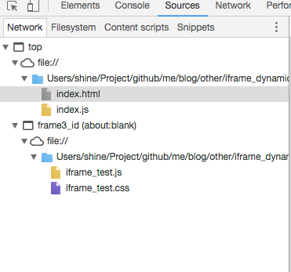

##	iframe 动态引用 js、 css 、dom元素

采用创建dom元素的方式

```
	var demo = {
		init: function () {
			var str = "<div>...</div>" 
			var popDiv=document.createElement('div'); 
			// popDiv.style.xx = xxx; 
			popDiv.id = "pop"; 
			popDiv.innerHTML = str; 

			var iframeBody = document.getElementById("frame_id").contentWindow.document.getElementsByTagName("body")[0]; 

			var iframeHead = document.getElementById("frame_id").contentWindow.document.getElementsByTagName("head"); 

			if(iframeHead && iframeHead.length){ 
				iframeHead = iframeHead[0]; 
			}else{ 
				iframeHead = iframeBody; 
			} 

			// // 添加 html 内容
			var elemDivTag = document.getElementById("frame_id").contentWindow.document.getElementById("pop"); 
			if(!elemDivTag){ 
				iframeBody.appendChild(popDiv)
			} 

			// // 添加 css 样式
			var oCss= document.createElement("link"); //（css类似） 
			oCss.id = "ocss1"; 
			oCss.type = "text/css";
			oCss.href="./iframe_test.css"; 
			oCss.rel="stylesheet";
			var cssTag;

			if(!cssTag){ 
				iframeHead.appendChild(oCss)
			} 
			oCss.onload = oCss.onreadystatechange = function(){ 
				console.log('css')
				if ((!this.readyState) || this.readyState == "complete" || this.readyState == "loaded" ){ 
				}else{ 
					console.info("can not load the oCss.js file"); 
				} 
			} 

			// // 添加 script 脚步
			var oScript= document.createElement("script"); //（css类似） 
			oScript.id = "oScript1"; 
			oScript.type = "text/javascript";
			oScript.src="./iframe_test.js"; 
			var scriptTag;
			if(!scriptTag){ 
				iframeHead.appendChild(oScript)
			} 
			oScript.onload = oScript.onreadystatechange = function(){ 
				if ((!this.readyState) || this.readyState == "complete" || this.readyState == "loaded" ){ 
				}else{ 
					console.info("can not load the oScript2.js file"); 
				} 
			} 

		}
	}

	demo.init()


```

Result:

